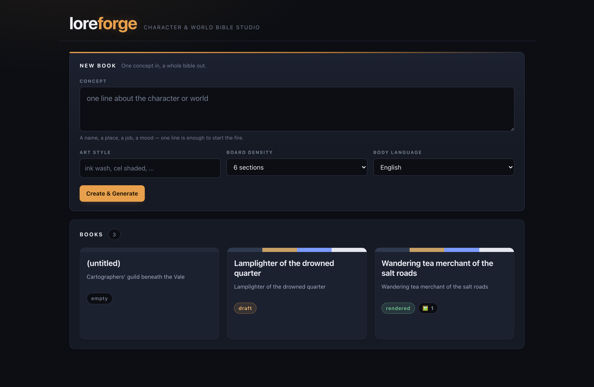
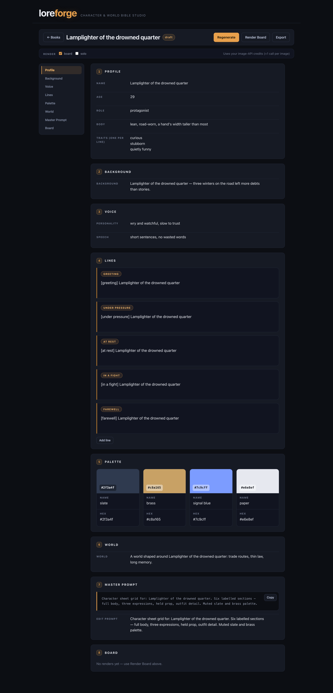

# loreforge

[](https://github.com/oh-namgyu/loreforge/actions/workflows/ci.yml)

> **한글 요약** — 한 줄 컨셉으로 캐릭터·세계관 설정집을 만드는 스튜디오입니다 — LLM이 프로필·성격·대사·컬러 팔레트·영문 마스터 이미지 프롬프트를 생성하고, 선택적으로 비주얼 보드까지 렌더하며, 웹 UI에서 편집하고 단일 HTML로 내보내 공유합니다. *(전체 한국어 문서: [README_KOR.md](README_KOR.md))*

A self-hosted **character & world bible studio**. Type one line about a
character, and loreforge turns it into a structured lore book — profile,
background, personality and speech, signature lines, a colour palette, world
notes, and an English **master image prompt** — then optionally renders that
prompt into a visual character board. Browse, edit and export it all from a
small web UI.

Everything lives in plain files on your own machine. Two API keys (one required,
one optional), no database, no accounts, no build step.

*(README_KOR.md — [한국어 문서](README_KOR.md))*

## How it works

```
one-line concept
      │
      ▼
  Generate ──► structured bible JSON  (1 Anthropic call, 2 if the first fails schema check)
      │        profile · background · voice · lines · palette · world · master_prompt
      ▼
  Review & edit in the UI            (no API calls — plain file edits)
      │
      ▼
  Render (optional) ──► board.png / solo.png   (1 OpenAI image call per kind)
      │
      ▼
  Export ──► one standalone HTML file, images inlined as data URIs
```

The two-step split is deliberate: text first, cheap and fast, so you never pay
for an image of a bible you have not read yet.

## Screenshots

**Home** — one concept in, a palette-forward grid of books out.



**Book detail** — sticky section nav, profile as a definition grid, large palette
tiles, the master prompt as a copyable code panel.



## Quickstart

### Local (venv)

```bash
python -m venv .venv && source .venv/bin/activate
pip install -r requirements.txt
export ANTHROPIC_API_KEY=sk-ant-...      # required
export OPENAI_API_KEY=sk-...             # optional, image rendering only
python app.py
```

Open <http://127.0.0.1:6180>. The JSON API lives under `/api`.

Want to see the UI without spending anything? `LOREFORGE_FAKE_LLM=1 python app.py`
runs the whole app against an offline fake — no keys, no network, no cost.

### Docker

```bash
cp .env.example .env        # fill in ANTHROPIC_API_KEY and AUTH_TOKEN
mkdir -p data && sudo chown 10001:10001 data
docker compose up -d
```

The container binds `0.0.0.0` inside its own network namespace, so **`AUTH_TOKEN`
is required** — the bind guard exits with code 1 without one, and compose will
refuse to start before that. Compose maps the port to `127.0.0.1:6180` on the
host, so nothing is exposed to your network until you change that line yourself.

## Configuration

All configuration is environment variables. See [.env.example](.env.example).

| Variable                | Default           | Meaning                                                       |
|-------------------------|-------------------|---------------------------------------------------------------|
| `ANTHROPIC_API_KEY`     | _(unset)_         | **Required.** Text generation. Without it `/generate` → `503`. |
| `OPENAI_API_KEY`        | _(unset)_         | Optional. Image rendering. Without it `/render` → `409`.       |
| `AUTH_TOKEN`            | _(unset)_         | Enables token login. **Required for any non-loopback bind.**   |
| `HOST`                  | `127.0.0.1`       | Bind address.                                                  |
| `PORT`                  | `6180`            | HTTP port.                                                     |
| `LOREFORGE_MODEL`       | `claude-sonnet-5` | Text model for bible generation.                               |
| `LOREFORGE_IMAGE_MODEL` | `gpt-image-1`     | Image model for board and solo renders.                        |
| `LOREFORGE_DATA`        | `./data`          | Root for `books/<slug>/` and the deleted-book trash.           |
| `LOREFORGE_TRASH_DAYS`  | `7`               | Age at which trashed books are purged on startup.              |
| `LOREFORGE_FAKE_LLM`    | _(unset)_         | `1` swaps in offline fakes for both providers (demo/tests).    |

## Costs

**loreforge spends your own API credits.** It is not a service and has no billing
of its own — it calls Anthropic and OpenAI with the keys you provide, and you pay
those providers directly at their published rates.

| Action                                   | API calls                                             |
|------------------------------------------|-------------------------------------------------------|
| **Generate** a bible                     | 1 Anthropic text call; **2** if the first reply fails schema validation (exactly one retry) |
| **Render** a board                       | 1 OpenAI image call **per kind** — board and solo are separate calls, so 1–2 per request |
| Browse, edit, save, export, delete       | 0 — these never leave your machine                    |

Text calls are capped at 4096 output tokens. Image calls are the expensive
half — rendering is never automatic, always a button you press, and the UI
states the per-image cost next to it.

## Privacy

- **What is sent out:** your concept and art-style text go to the Anthropic API on
  *Generate*; the generated master image prompt goes to the OpenAI API on
  *Render*. That is the complete list of outbound traffic.
- **What is not:** there is **no telemetry, no analytics, no crash reporting and no
  update check**. loreforge makes no other network calls of any kind.
- **Where your data lives:** on your disk, under `data/books/<slug>/` as plain
  `book.json` and `.png` files. Deleted books are moved to `data/.trash/` and
  purged after 7 days. Nothing is uploaded anywhere.
- **API keys** are read from the server environment only. They are never written to
  disk, returned in a response, or logged.
- Both providers apply their own data-handling policies to what you send. Review
  them before feeding loreforge anything confidential.

## Security model

loreforge is a **single-user, self-hosted** tool.

- **Loopback by default.** `HOST=127.0.0.1` and, in Docker, the compose port map.
- **Refuses unsafe exposure.** Binding a non-loopback address without `AUTH_TOKEN`
  is a hard startup failure, not a warning.
- **Token login when exposed.** `AUTH_TOKEN` turns on a login form, a constant-time
  token comparison, and an HMAC-signed `httpOnly` / `SameSite=Strict` session
  cookie with an 8-hour lifetime. Mutating requests additionally pass a
  same-origin `Origin`/`Referer` gate.
- **No TLS of its own.** Traffic is plain HTTP; a non-loopback bind prints a
  warning saying so. Put it behind a TLS-terminating reverse proxy before
  exposing it to anything.
- **Single worker by design.** Book writes are serialised with in-process locks,
  so gunicorn/uwsgi multi-worker deployments are unsupported and will corrupt
  concurrent writes. The Docker image runs one process on purpose.

Full threat model: [SECURITY.md](SECURITY.md).

## Sharing your work

*Export* produces **one standalone HTML file** with every image inlined as a data
URI and every string server-escaped. It has zero external references, so it opens
straight from `file://`, offline, in any browser — and that single file is the
unit you hand to someone else. loreforge itself is single-user; sharing means
sharing the exported file, not sharing the running instance.

## Development

```bash
pip install -r requirements-dev.txt
playwright install chromium      # once, for the browser tests

python -m pytest -q              # unit suite — no network, no keys
python -m pytest e2e -q          # browser round trips against a real server
```

The unit suite needs neither a network nor an API key: the provider SDKs are
imported lazily and the tests inject fakes. The e2e suite starts the real
`app.py` on a temp data directory with `LOREFORGE_FAKE_LLM=1`, and **skips**
rather than fails when chromium is not installed.

Conventions: files stay under ~300 lines, all styling lives in the global
`static/style.css` (no inline styles), and user/LLM-derived strings are injected
with `textContent` only. See [CONTRIBUTING.md](CONTRIBUTING.md).

## Limitations

- **Single process, single user.** No accounts, no roles, no per-user data. One
  `AUTH_TOKEN` shared by whoever you give it to.
- **No horizontal scaling.** In-process locks mean one worker; see above.
- **Edits must satisfy the generation schema.** `PATCH /api/books/<slug>/bible`
  validates the *merged* bible, so an edit that drops below 5 signature lines,
  above 8, outside 4–6 palette entries, or writes a hex that is not `#RRGGBB` is
  rejected and nothing is written.
- **Input bounds.** Concept ≤ 4000 characters, art style ≤ 200, slug
  `[a-z0-9-]{1,64}`.
- **Two image kinds only** — `board` and `solo`. Per-section split rendering is
  not implemented.
- **No rate limiting.** Nothing throttles generation or rendering; a shared token
  is a shared spending limit.
- **No TLS, no multi-language UI.** The UI is English; only the bible *body*
  language is selectable (`en` / `ko`).

## License

MIT — see [LICENSE](LICENSE).
